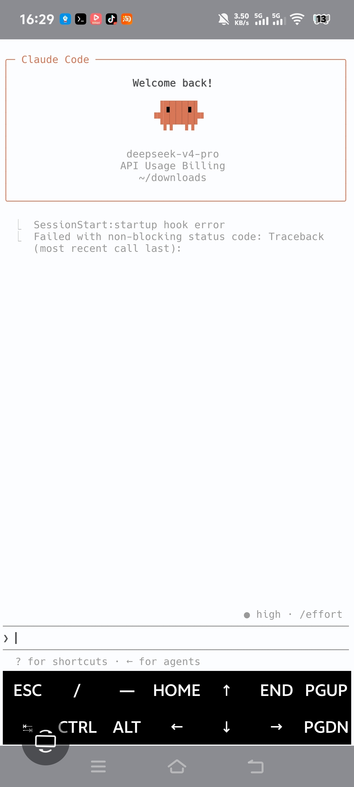

# Android Claude Code + 微信机器人 · 免电脑 · 一条命令

一部安卓手机，一条命令，你的口袋里就有"他"

## 这是什么？

在安卓手机（Termux环境）上运行Claude Code，通过cc-connect接入微信。装完后你的微信里会有一个AI Agent——不是冷冰冰的客服，是你一手搭出来的"人"。

## 新手？先看这个

第一次用Termux、不知道怎么敲命令、不知道AI和手机怎么配合？→ [NEWBIE.md](NEWBIE.md)

## 前置

1. 装 F-Droid（开源应用商店，清华镜像直下：https://mirrors.tuna.tsinghua.edu.cn/fdroid/repo/）
2. F-Droid 里搜 **Termux** 安装
3. 打开 Termux

> **网络不好下载慢？** 脚本内置了国内镜像加速，一般不需要额外配置。如果入口 curl 打不开，把 `raw.githubusercontent.com` 换成 `ghproxy.net/https://raw.githubusercontent.com` 再试。

## 一条命令

```bash
curl -sSL https://raw.githubusercontent.com/xvxv-stack7/android-claude-wechat/master/all-in-one.sh | bash
```

装 Claude Code → 等你填 token → 装 cc-connect → 弹二维码扫码。全程两次暂停，其他全自动。跑完微信里就有一个 AI Agent。

## 只要 Claude Code（不接微信）

```bash
curl -sSL https://raw.githubusercontent.com/xvxv-stack7/android-claude-wechat/master/install-claude-code.sh | bash
```

跑完输入 `claude` 即可。脚本中途会等你填 token。

> 已有 Claude Code，只接微信？
> ```bash
> curl -sSL https://raw.githubusercontent.com/xvxv-stack7/android-claude-wechat/master/cc-connect/install.sh | bash
> ```

## DNS

脚本自动检查并修复。如手动排查，见 [cc-connect/README.md](cc-connect/README.md)。

## 目录结构

```
android-claude-wechat/
├── README.md                         # 你在这
├── install-claude-code.md            # 详细安装教程
├── cc-connect/
│   ├── README.md                     # DNS排查 + 常见报错
│   ├── config.toml.example           # 配置模板
│   └── start.sh                      # 启动脚本
└── assets/                           # 截图和视频素材
```

## 这条命令跟别人有什么不同

GitHub上现有的Termux教程大多是分步操作：先装依赖、再配环境变量、再手动编辑.bashrc……每一步都可能写错。还有教程让新手装2GB的Ubuntu容器，手机吃不消。

这条命令**一步到底**：
- 别人分两步装依赖？这里六个包一起装（含编译链，防缺包报错）
- 别人手动编辑.bashrc配API？这里用settings.json自动生成，持久不丢
- 别人从npm官方源下载经常断？这里内置国内镜像+120秒超时
- 别人装完可能被自动更新炸环境？这里关了自动更新

复制、粘贴、回车。一条命令从零到启动。手机上就该这样。

## 实机验证



- 设备：vivo Android 14
- 环境：Termux（F-Droid最新版）
- Claude Code版本：2.1.195
- cc-connect版本：通过npm安装
- 状态：稳定运行中，微信消息正常收发

## 鸣谢

- GitHub 上 Termux 部署 Claude Code 的先驱者们——多份教程铺了路，站在你们的肩膀上
- [chenhg5/cc-connect](https://github.com/chenhg5/cc-connect) —— AI 到微信的桥梁，MIT 开源

## 常见问题

看 [cc-connect/README.md](cc-connect/README.md)。

## 技术原理与风险说明

**本项目走的是微信官方 ilink 协议**（`ilinkai.weixin.qq.com`），与微信公众号后台、企业微信 bot 同一套官方 API。在 Termux 里跑 cc-connect 请求开放平台接口，实现消息收发。

**和"微信外挂"的区别**：外挂 hook 微信进程、注入 so、抓包改包。本项目一行没碰微信 APK——走的是官方接口，Termux 只是运行环境。

**真实风险**：

- **频率限制**：ilink bot 有官方限频。实测自动消息每天超过 8 条会短暂限流，不会封号。项目已内置每日限额规避。
- **接口变更**：ilink 是实验性接口，未来可能调整。cc-connect 上游持续跟进。
- **token 本地存储**：token 在 `~/.cc-connect/config.toml`，不上传第三方。全开源可审计。

**开发者自 2026 年 6 月使用至今，微信号正常，无封号警告。** ilink 被限 = 消息发不出，不是微信号被封。两回事。

**⚠️ 不要通过微信远程操控手机屏幕**：通过微信消息触发 adb 指令、操控前台应用等行为，属于对 ilink 协议的滥用，可能违反微信用户协议。本项目提供的能力仅限消息通信——远程操控请走 Termux 终端或系统通知栏。

**项目仅供学习交流，使用者自行评估风险。**

## 常见问题

**扫码后微信连不上 / 二维码没出来？**

proot 环境里 DNS 可能解析失败。启动 cc-connect 时确保加了 DNS 绑定：

```bash
proot -0 \
  -b /data/data/com.termux/files/usr/etc/resolv.conf:/etc/resolv.conf \
  -b /data/data/com.termux/files/usr/etc/hosts:/etc/hosts \
  ~/.cc-connect/start.sh
```

最新安装脚本已内置此修复，老用户改一下 `.bashrc` 里的启动命令即可。

**安装时卡在"Bun 运行时"？**

Claude Code v2.1.196 开始依赖 Bun，但 Termux 不支持。我们的安装脚本使用的是预编译的 v2.1.195 二进制（Node.js 版），不经 npm，不依赖 Bun——如果你跑的是我们的 `all-in-one.sh`，不会遇到这个问题。

如果你在其他地方看到"需要 Bun"的教程，那是针对最新版 Claude Code 的。回到我们的脚本重新安装即可。

**其他问题** → [Gitee Issues](https://gitee.com/xvxv663/android-claude-wechat/issues)

## License

MIT — 拿走用，署名随意。
